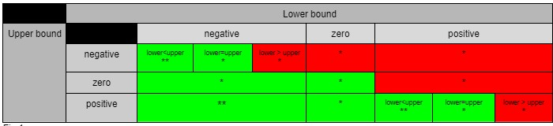

@@ -1,38 +0,0 @@
**SENG 438 - Software Testing, Reliability, and Quality**

**Lab. Report \#2 – Requirements-Based Test Generation**

| Group \#:      |     |
| -------------- | --- |
| Student Names: | Rodrigo Amesty    |
|                | Ernest Nikolaychuk    |
|                | Dyson Davis    |
|                |  Truman Yen   |

# 1 Introduction

In this lab we tested a variety of functions provided by the teaching team at SENG 438. Each member had a set of functions they had to test, and were responsible for setting up there testing environment. We had an opportunity to practice black box testing techniques such as boundary values and equivalence classes. Furthermore, Some major benefits of using mock objects while conducting tests is that they allow you to mimic object behaviour. This allows us to test an object without having to create complete objects. This is a huge advantage as some objects only occur in certain scenarios, so you would have to have a large portion of your program running just to test a singular function. This saves both time, memory and energy when conducting tests. However the drawbacks are that when making mocks, you are not testing a function with the real object that it would interact with otherwise. Furthermore, not all test cases require mocks, so defining them in certain situations can prove wasteful.

# 2 Detailed description of unit test strategy

To formulate test cases, we separated each of the functions under test into equivalence classes. Each test may have had unique equivalence classes. So each time a test was performed we defined the equivalence classes. Under each function you will find all of our equivalence classes, which could then be used to find partitions, as well as boundary values. Each function will also indicate the boundary values used for testing.

# 3 Test cases developed

# Functions tested for DataUtilities

### Functions tested for DataUtilities

### calculateColumnTotal and calculateRowTotal
- These functions will be tested with similar test cases
- Weak robust testing will be performed using mock objects. Weak ECT is used because performance of each partition is unlikely to affect the performance of other partitions
- Partitions:
  - Row/column selected:
    - Positive row/column exists in Values2D input (valid)
    - Positive row/column out of bounds in Values2D input (invalid)
    - Negative row/column input (invalid)
  - Polarity of sum:
    - Row/column sums to positive number (valid)
    - Row/column sums to negative number (valid)
    - Row/column sums to zero (valid) (boundary)
  - Type of input values:
    - Integer values in Values2D (valid)
    - Decimal values in Values2D (valid)
    - Null (invalid)
    - Empty table (invalid)
- Test list:
  - test_columnTotal_indexOutofBounds()
    - Expect output of 0
  - test_columnTotal_indexNegative()
    - Expect output of 0
  - test_columnTotal_positiveSum()
    - Expect correct hand calculated sum
  - test_columnTotal_negativeSum()
    - Expect correct hand calculated sum
  - test_columnTotal_zeroSum()
    - Expect sum of 0
  - test_columnTotal_decimalValues()
    - Expect correct hand calculated sum
  - test_columnTotal_nullValues()
    - Expect InvalidParameterException thrown
  - test_columnTotal_emptyValues()
    - Expect InvalidParameterException thrown
  - test_rowTotal_indexOutofBounds()
    - Expect output of 0
  - test_rowTotal_indexNegative()
    - Expect output of 0
  - test_rowTotal_positiveSum()
    - Expect correct hand calculated sum
  - test_rowTotal_negativeSum()
    - Expect correct hand calculated sum
  - test_rowTotal_zeroSum()
    - Expect sum of 0
  - test_rowTotal_decimalValues()
    - Expect correct hand calculated sum
  - test_rowTotal_nullValues()
    - Expect InvalidParameterException thrown
  - test_rowTotal_emptyValues()
    - Expect InvalidParameterException thrown
- Mocking: 6 mock objects (mocking Values2D) will be used
  - Positives
  - Negatives
  - Decimals
  - Empty
  - Zeroes
  - Null
  - All mock objects will throw an IndexOutOfBoundsException if getValue() is called with indices out of bounds

### createNumberArray
- Performed weak robust equivalence testing
- Equivalence classes for double array in input:
  - Negative doubles (-infinity: 0)
  - Positive double (0:infinity)
  - Null
  - Empty array
- Boundary values:
  - Values at double end points (−1.7976931348623157×10308 ,  1.7976931348623157×10308)
- Test cases
  - createNumberArrayTestNegativeDoubles -> testing negative doubles
  - createNumberArrayTestPositiveDoubles -> testing positive doubles
  - createNumberArrayTestEmptyArray -> testing empty array of doubles
  - createNumberArrayTestMaxArray -> testing
  - createNumberArrayTestNullValues

**Purpose:** testing null values

## createNumberArray2D

**Purpose:** testing for a 2D double array

**Method:** strong robust equivalence testing

**Equivalence classes for double array in input:**
- Negative doubles (-infinity: 0)
- Positive double (0:infinity)
- Null
- Empty array

**Boundary values:**
- Values at double end points (-1.7976931348623157x10^308, 1.7976931348623157x10^308)

**Test cases**
- create2DNumberArrayTestNegativeDoubles -> testing negative doubles
- create2DNumberArrayTestPositiveDoubles -> testing positive doubles
- create2DNumberArrayTestEmptyArray -> testing empty array of doubles
- create2DNumberArrayTestMaxArray -> testing max double array
- createNumberArray2DTestNullValues -> testing null values

## getCumalitivePercentages

**Purpose:** testing for cumulative percentages

**Method:** weak equivalence class testing with 1 valid partition

**Equivalence classes:**
- Positives: (0 : infinity)
- Negatives: (-infinity :  -1)

**Boundary values:**
(-1, 0, 1)

**Test Cases:**
- testGetCumalitivePercentagesReturnsCorrectValueAtIndexZeroForIntKeys -> testing positive numbers
- testGetCumalitivePercentagesReturnsCorrectValueAtIndexOneForIntKeys -> testing positive numbers
- testGetCumalitivePercentagesThrowsExceptionForValueZero() -> testing boundary value zero
- testGetCumalitivePercentagesThrowsExceptionForValueNegativeInt() -> testing boundary value -1 and equivalence class negative numbers

## Range()

**Purpose:** testing range function

**Method:** strong robust equivalence class testing (ECT) with 3 partitions

**Partitions:**
- Lower bound polarity: negative (valid), positive (valid)
- Boundary values: lower bound == 0 (valid)
- Upper bound polarity: negative (valid), positive (valid)
- Boundary values: upper bound == 0 (valid)
- Difference between upper and lower bounds: lower bound < upper bound (valid), upper bound < lower bound (invalid)
- Boundary values: upper bound == lower bound (valid)

- asterix means a test to be written for this function and double asterix has been covered by another group mate  

**Test cases/equivalent classes:**
- Green equivalent classes will be tested for correct getter outputs, and red equivalent classes will be tested for exceptions thrown
- Equivalent classes already covered in other tests

### Range() test list:
- test_negLower_negUpper_lowerEqualUpper
- test_negLower_negUpper_lowerGreaterUpper
- test_zeroLower_negUpper
- test_posLower_negUpper
- test_negLower_zeroUpper
- test_zeroLower_zeroUpper
- test_posLower_zeroUpper
- test_zeroLower_posUpper
- test_posLower_posUpper_lowerEqualUpper
- test_posLower_posUpper_lowerGreaterUpper

### getCentralValue

Tested using strong normal ect, since edge cases were covered in other tests for range.

**Lower Bound**
- Negative Value (valid)
- Positive Value (valid)
- Zero (valid)

**Upper Bound**
- Negative Value (valid)
- Positive Value (valid)
- Zero (valid)

Tested using the objects (-10,10), (20,50), (-40,-20), (0, 0) to cover all possibilities of negative and positive bounds.

**Test List**
- centralValueTestNegPos -> test for (-10, 10)
- centralValueTestPosPos ->  test for (20, 50)
- centralValueTestNegNeg -> test for (-40, -20)
- centralValueTestZero -> test for (0, 0)

### getLength

Tested using Strong Robust ECT with 2 partitions.

**Lower Bound**
- Negative Value (valid)
- Positive Value (valid)

**Upper Bound**
- Negative Value (valid)
- Positive Value (valid)

Tested using the objects (-10,10), (20,50), (-40,-20) to cover all possibilities of negative and positive bounds.

**Test List:**
- exampleRangeOneLengthTest()
  Expect Length of 20
- exampleRangeTwoLengthTest()
  Expect Length of 30
- exampleRangeThreeLengthTest()
  Expect Length of 20

### getLowerBound and getUpperBound

Both Upper and Lower Bounds will be tested using the same methodology.
Tested Using Strong Robust ECT with 2 partitions.

**Lower Bound**
- Negative Value (valid)
- Positive Value (valid)

**Upper Bound**
- Negative Value (valid)
- Positive Value (valid)

Tested using the objects (-10,10), (20,50), (-40,-20) to cover all possibilities of negative and positive bounds.

**Test List:
- exampleRangeOneLowerBoundTest()
  Expect Lower Bound of -10
- exampleRangeTwoLowerBoundTest()
  Expect Lower Bound of 20
- exampleRangeThreeLowerBoundTest()
  Expect Lower bound of -40
- exampleRangeOneUpperBoundTest()
  Expect Upper Bound of 10
- exampleRangeTwoUpperBoundTest()
  Expect Upper Bound of 50
- exampleRangeThreeUpperBoundTest()
  Expect Upper Bound of -20

# 4 How the team work/effort was divided and managed

The work was divided by assigning members to test different functions. Most members tested 3 functions, while there was one who tested 1. That person was tasked with formatting the report. Each member had to outline the equivalence classes, boundary values, and partions for their functions. They also had to write how they were going to approach their test, whether that be weak-normal ect, weak robust ECT etc.

# 5 Difficulties encountered, challenges overcome, and lessons learned

An obstacle encountered was setting up the testing environment on a local machine. Most members had several issues before they could even start testing. This was overcome by asking other members for help, and everyone was able to get it setup. Another obstacle was how to properly use Mock objects in a test case. The issue was that certain tests did not require mock objects, and it was up to the user to identify where they would be needed and how to initialize them for their purposes. The most significant lesson learnt was to better prepare for upcoming labs, as there was cerainly a time constraint for this one.

# 6 Comments/feedback on the lab itself

The lab itself showed us the essentials of black box testing, and how to plan and implement tests. Members learnt more about ect, partitions and boundary values, as well as their significance when creating tests. Group members also communicated and conducted research to create the best possible overall tests.